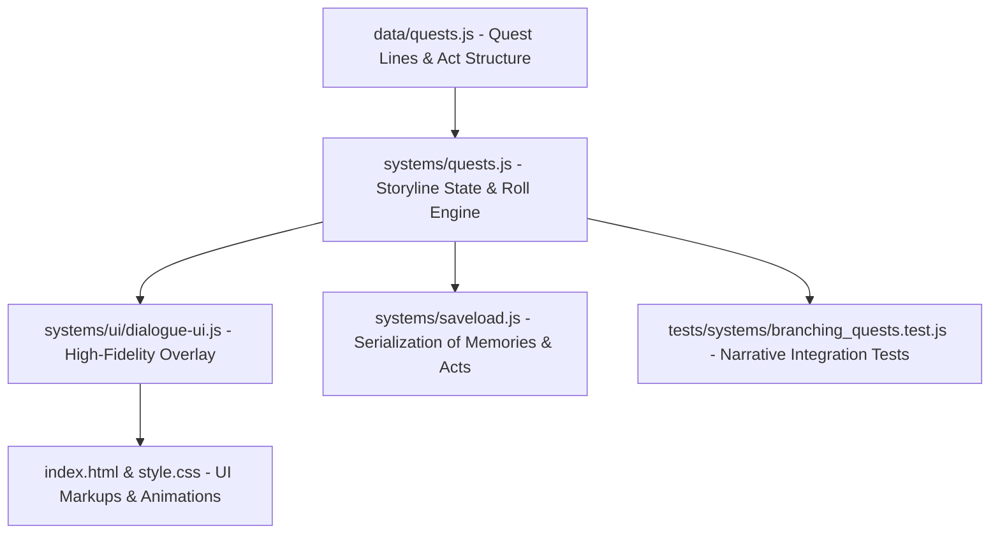

# Implementation Plan - Dialogue Engine & NPC Questlines

This document outlines the design, architecture, and step-by-step technical implementation plan to introduce a **Deep Interactive Dialogue Engine** and **Expanded NPC Questlines** in *Space Adventure*.

The goal is to create story-based quests with tasks that link together and have branching paths, eventually forming a complete main storyline (with 3-Act structure, faction alignments, and multiple endings) along with planetary sidequests.

---

## User Review Required

We have designed a robust system that integrates tightly with the existing game state. Before executing, please review the following design decisions:

1. **Probabilistic vs. Deterministic Skill Checks**:
   * **Proposal**: Introduce a **probabilistic d20 virtual dice roll** for attribute-based checks (e.g. Intimidate, Hack, Negotiate). The player's respective stat (e.g. Attack for intimidation, Intelligence for hacking) will act as a modifier added to the d20 roll, comparing against a Difficulty Class (DC) set in the quest data. 
   * **Benefit**: Adds suspense, mimics tabletop RPG mechanics, and provides high-visual value via a CRT-themed rolling dice animation on screen.
   * **Note**: Role-based (Warrior, Scientist, Rogue) and race-based checks will remain deterministic (guaranteed success if you match the role/race).
2. **Main Story Flow**:
   * **Proposal**: Main storyline quests will automatically chain and accept their successor quests upon completion of the previous quest, ensuring narrative momentum. Sidequests and faction-exclusive contracts will be accepted manually from the updated **Planetary Quest Boards**.
3. **Endgame & Epilogues**:
   * **Proposal**: Completing the Act III finale will trigger a narrative text-crawl epilogue summarizing the player's choices and their permanent impact on the galaxy (Federation Peace, Corsair Anarchy, or Syndicate Singularity). After the epilogue, the player can choose to enter **Free-Roam Mode** (allowing them to finish sidequests and explore derelicts) or return to the main menu.

---

## Open Questions

> [!IMPORTANT]
> Please provide your feedback on these items or approve them as proposed:
> 1. **Dice Roll Modifiers**: Should we scale the difficulty classes (DCs) dynamically based on the player's level, or keep them static to reward players who over-level or specialize in specific attributes? *We recommend static DCs (e.g., DC 12 for easy, DC 16 for medium, DC 20 for hard) so that leveling up makes checks visibly easier, reinforcing progression.*
> 2. **Companion Banter**: Would you like choices made during dialogue to affect companion trust in real-time? (e.g., selecting a ruthless pirate option increases Apex's trust but decreases Dr. Lyra's trust). *We propose adding a trust-modification hook to dialogue choices, linking the quest system directly to the companion social loop.*

---

## Proposed Changes

We will implement this feature across the data, systems, UI, and test layers:

### 1. Data Layer

#### [MODIFY] [quests.js](file:///d:/source/Roogames/Space%20Adventure/data/quests.js)
* **Main Storyline Structure**: Rewrite the quest dictionary to define a cohesive 3-Act structure:
  * **Act I: The Signal** (`story_act1`): Investigate an ancient transmission on Terra Prime. Culminates in a choice of which faction to deliver the decrypted logs to.
  * **Act II: Faction Cold War** (`story_act2_fed`, `story_act2_cor`, `story_act2_syn`): Faction-specific questlines involving smuggling, sabotage, or diplomacy.
  * **Act III: The Galactic Crucible** (`story_act3`): Final peace summit or space armada battle.
* **Successor Anchors**: Add a `successorQuests` object to branching steps/choices to dictate what quest is auto-accepted next.
  * Example: `successorQuests: { federation: "story_act2_fed", corsairs: "story_act2_cor", syndicate: "story_act2_syn" }`
* **Attribute Roll Specs**: Define DC and stat requirements for dialogue choices:
  * Example: `roll: { stat: "attack", dc: 15, successStep: 3, failureStep: 4 }`

---

### 2. System Logic Layer

#### [MODIFY] [quests.js](file:///d:/source/Roogames/Space%20Adventure/systems/quests.js)
* **Storyline State Machine**:
  * Track `state.storyline = { act: 1, alignment: "neutral", variables: {} }`.
  * Update `completeQuest` to read the quest's successor rules and automatically invoke `acceptQuest(nextQuestId)`.
* **RNG Dialogue Roll Engine**:
  * Implement `executeDialogueRoll(questId, choiceIndex)` which rolls a 1-20 random number, adds the player's stat modifier, and evaluates against the choice's `dc`.
  * Route the player to the `successStep` or `failureStep` index based on the outcome.
  * Send progress, dice values, and modifiers to the UI overlay for animation.
* **Trust & Reputation Hook**:
  * Update choice evaluations to modify companion trust if a companion is active in the party (e.g. `choice.companionTrust: { apex: 10, lyra: -5 }`).

#### [MODIFY] [character.js](file:///d:/source/Roogames/Space%20Adventure/systems/character.js)
* Initialize `state.storyline` upon character creation.

#### [MODIFY] [saveload.js](file:///d:/source/Roogames/Space%20Adventure/systems/saveload.js)
* Ensure `state.storyline` is fully serialized into LocalStorage and restored on load, preserving narrative progression across sessions.

---

### 3. User Interface Layer

#### [NEW] [dialogue-ui.js](file:///d:/source/Roogames/Space%20Adventure/systems/ui/dialogue-ui.js)
* Create a dedicated high-fidelity dialogue manager:
  * **Render Dialogue Overlay**: Displays NPC avatars, names, faction badges, and active emotional state (e.g. Friendly, Suspicious, Hostile) based on disposition.
  * **Animated Dice Roll Component**: Renders a virtual d20 rolling container. When a skill check is selected, lock inputs, play a fast-paced numbers-scrambling animation, display the final roll and modifier, and show a flashing `SUCCESS` or `FAILURE` banner before proceeding.
  * **Choice List**: Renders dialogue options. Highlights skill checks with color-coded badges (e.g., `[INTIMIDATE (ATK) - DC 15]`).

#### [MODIFY] [notifications.js](file:///d:/source/Roogames/Space%20Adventure/systems/ui/notifications.js)
* Delegate complex dialogue steps from `showDialog` to the new `dialogue-ui.js` module, keeping `showDialog` reserved for basic alerts/reports.

#### [MODIFY] [quest-ui.js](file:///d:/source/Roogames/Space%20Adventure/systems/ui/quest-ui.js)
* Update the Planetary Quest Board interface to display quests categorized by type (Main Story, Sidequest, Faction Contract) with corresponding aesthetic styling.

#### [MODIFY] [index.html](file:///d:/source/Roogames/Space%20Adventure/index.html)
* Add HTML markup for the new **Dialogue Overlay screen** (`
`):
  * Left panel: NPC Portrait/Avatar, Nameplate, Faction, Mood indicator.
  * Right panel: Dialogue text container, Dice roll visualization box, and the Choices container.
* Add structural elements for the upgraded **Job Board** list.

#### [MODIFY] [style.css](file:///d:/source/Roogames/Space%20Adventure/style.css)
* Add styles for the dialogue overlay, including:
  * Glassmorphism background overlays.
  * Color-coded mood borders (Green for pleased, Gold for neutral, Red for hostile).
  * Scanline CRT effects for the dice roll container.
  * Glowing animations for successful rolls and warning pulses for failed ones.

---

## Verification Plan

### Automated Tests
We will expand the Jest integration suite to verify the narrative state machine:
* **Command**: `npm test`
* **Test File**: `tests/systems/branching_quests.test.js`
* **Test Cases**:
  1. *Quest Chaining*: Complete Act I and assert that the correct Act II quest is automatically accepted based on the faction chosen.
  2. *Dialogue Roll Calculation*: Mock the random rolls and assert that a passing roll modifies stats/dispositions and routes to the success step, while a failing roll routes to the failure step.
  3. *Save/Load Consistency*: Save a game in Act II with specific memory flags and faction alignment, load it, and assert that the narrative state is restored.

### Manual Verification
1. **Dialogue UI & Animation Check**:
   * Trigger a dialogue step with a skill check.
   * Verify the virtual d20 roll animation executes, displays the correct modifier, and applies the outcome.
2. **Quest Board Interactions**:
   * Visit Terra Prime, Xylo Delta, and Nebula Outpost.
   * Open the Planetary Quest Board, accept a sidequest, and verify it populates the quest log with the appropriate category badge.
3. **Endgame Narrative Crawl**:
   * Complete the Act III finale.
   * Verify that the customized epilogue text crawl displays correctly based on chosen alignments, followed by successful transition to Free-Roam Mode.
